# Communication Analyzer System - Screenshots

### Basic Query interface - Topic or Participant selection
The basic query interface allows you to select conversation `topics` and `participants` within a time-interval. This will
filter all the conversations in aggregated or in a detailed view for your analysis.

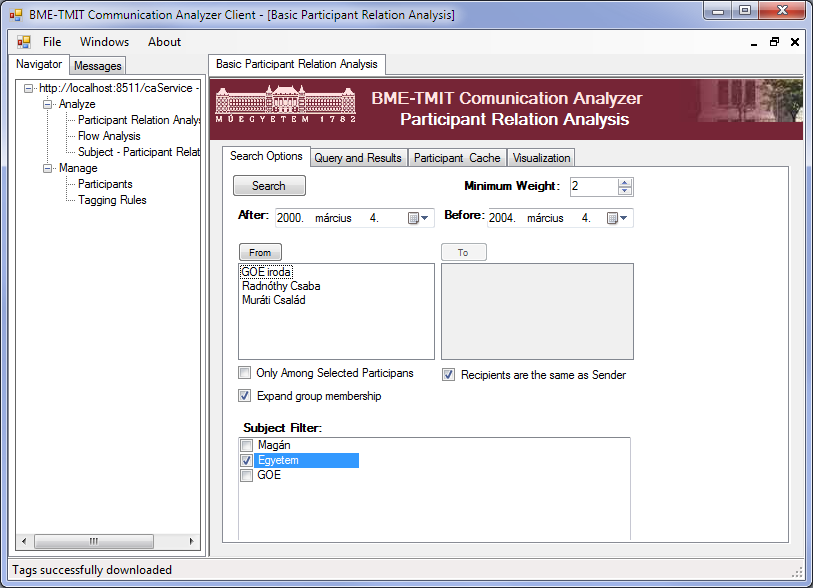

### Topic-Group conversation visualization
The most basic communication view shows the conversation the high-level `topics` among `groups` in a direct on indirect graph with the topic `weight` as its relevance and frequency.

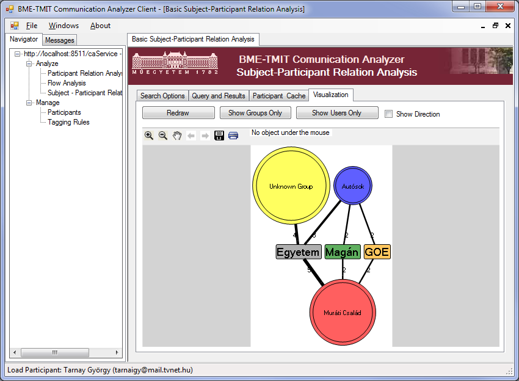

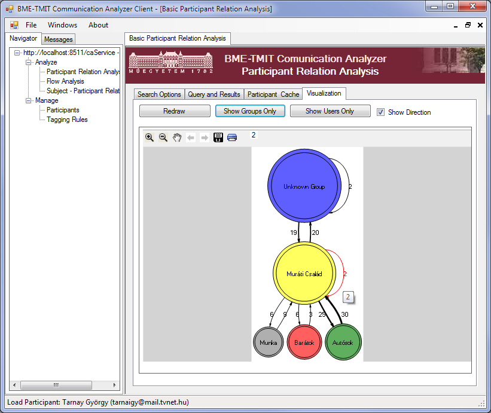

### Detailed User-based communication visualization
You can also drill into details within a `group` or in a `topic` to see more details on the actual conversations in any direction:

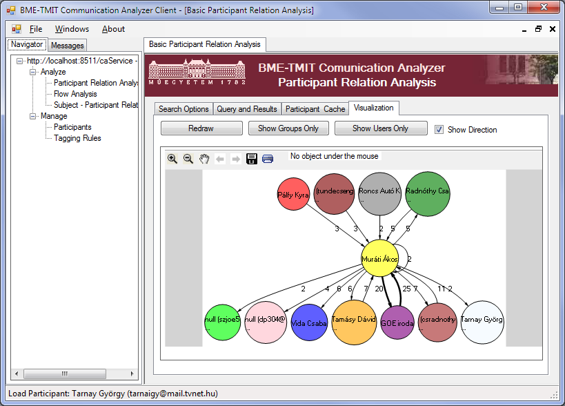

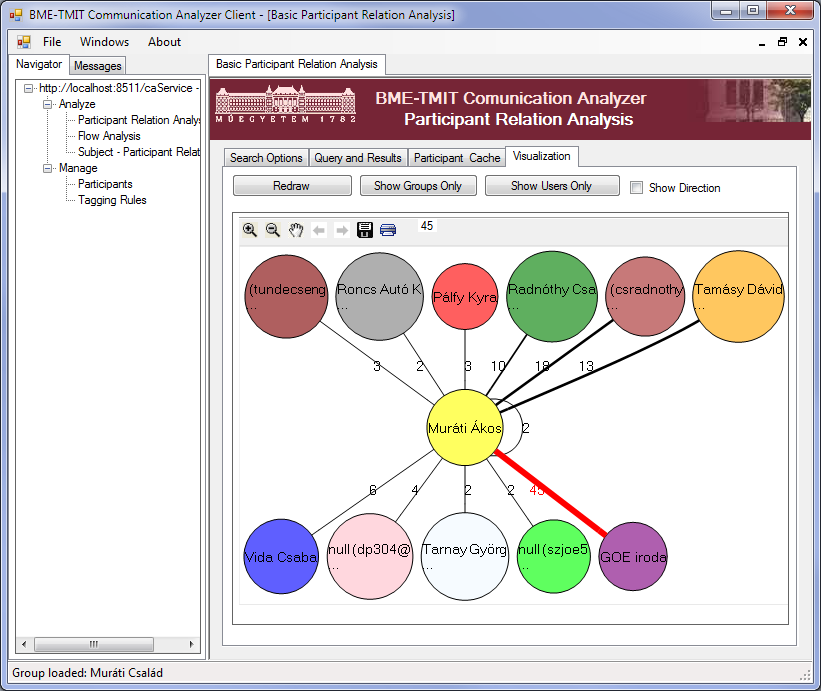

Including a `timeline` based thread view for full message history:
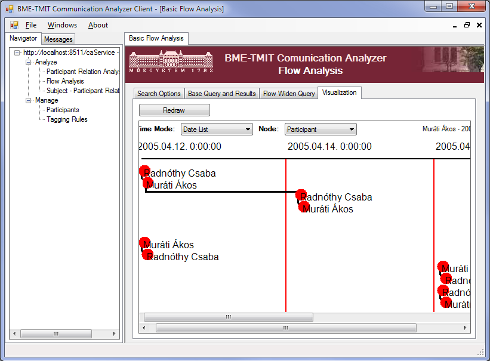

### Other configuration screens
The following screens demonstrate the basic maintenance and configuration views for the Communication analyzer client and
server.
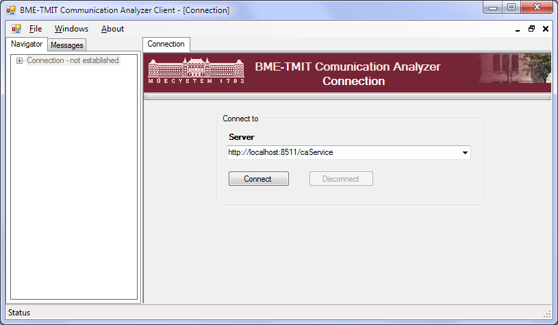

#### Participant search view
The current implementation of this service doesn't integrate with
standard directory services (eg: AD or Google Apps Groups) yet.
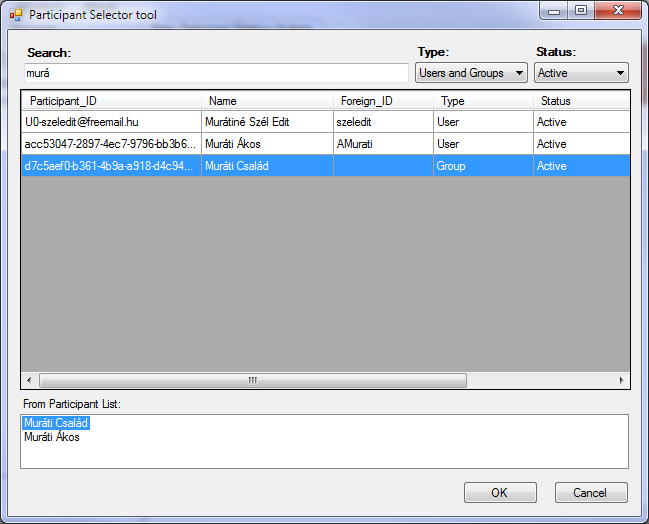

Multiple addresses can be assigned to same entities for better recognition and analysis both from the UI with mass-replace tools
or via other service connectors and integrators.
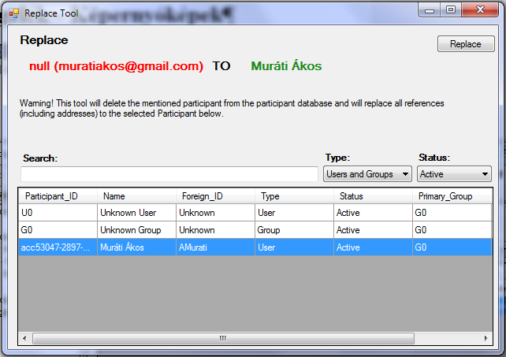
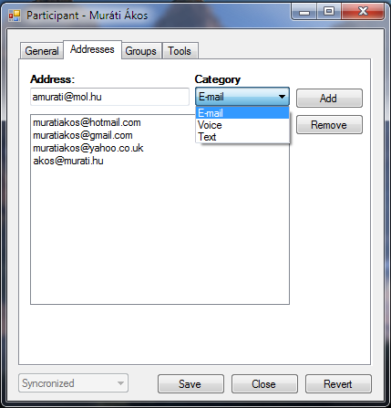
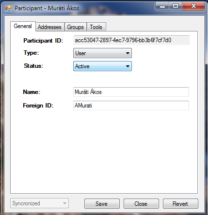
